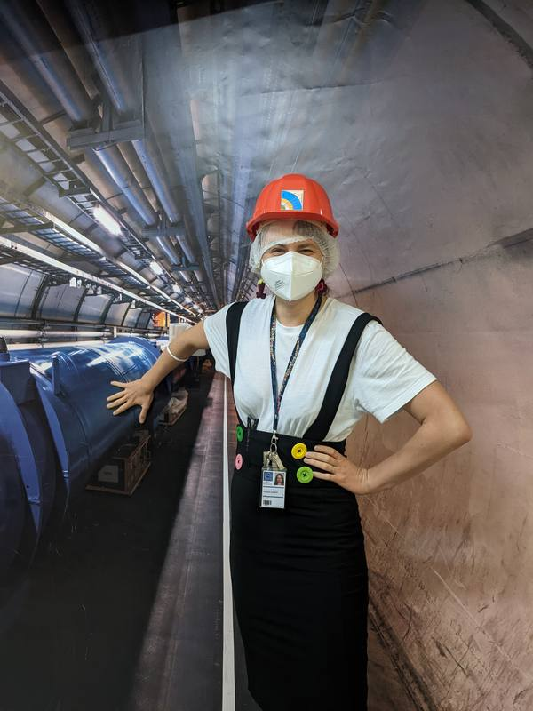

Tohle je zkušební příspěvek. Jeho jediným úkolem je dokázat, že cesta
„napiš .md soubor → ulož → commit → push" opravdu skončí živou stránkou
na internetu, a že se do ní správně vloží i fotka ze stejné složky.

V CERNu jsem strávila víc hodin v řídicích místnostech, než bych se
přiznala u večeře, ale žádná z těch obrazovek nikdy nevyžadovala, abych
si sama napsala YAML frontmatter. Přesto to jde.

Až tenhle příspěvek uvidím na skutečné adrese s obrázkem výše správně
zobrazeným, smažu ho a začnu psát ty opravdové sloupky.
