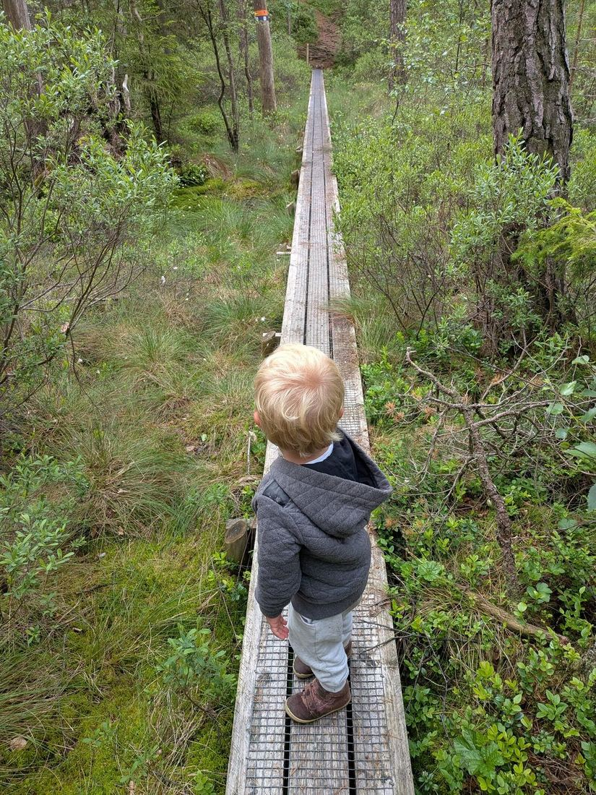
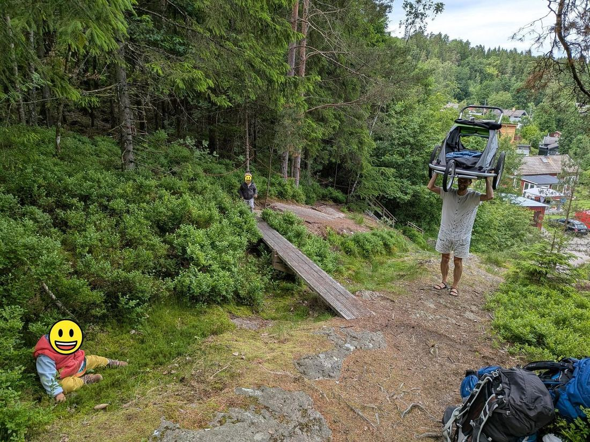
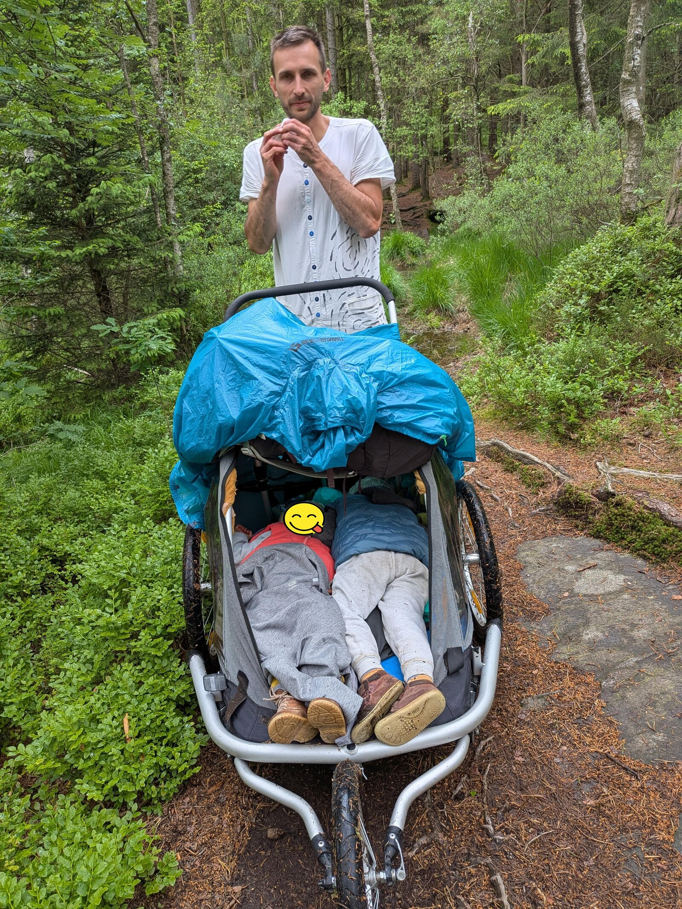

We got invited to a wedding in Sweden. And we thought, well, if we have to get on a plane anyway, let's try doing a proper backpacking trip, the four of us. Me, my husband Eda, our two-and-a-half-year-old at the time, and our one-and-a-quarter-year-old.

We thought and thought. How do you pack a tent, sleeping bags and mats plus food for four people into backpacks for two, so that there's potentially room left over for two small creatures who may well refuse to walk? We decided to backpack for two days before the wedding and two days after: with a party like ours, there was no way to carry a week's worth of food for us and for our little gluttons. At the wedding we'd top up the calories. And three nights we could probably handle.

Naturally, two days before the flight I discovered that the kids didn't have passports. So we hastily moved the tickets to the day before the wedding and hoped we'd at least get our trip in afterwards.

We debated whether to take a stroller (extremely practical in town and extremely impractical off-road), a giant off-road two-seater bike trailer in stroller mode, or Eda's favourite option: grandpa's handcart. And while grandpa's handcart is objectively the best thing for most one-day hikes in the Czech mountains, it lacks one basic feature that is essential in Sweden, and that is protection from rain.

So we went with the giant rented off-road trailer. First we loaded it onto the bus that took us to the metro in Prague. There we discovered that this two-seater trailer in stroller mode is extremely impractical for getting around Prague: it doesn't fit on an escalator, in some cases on stairs at all, in a lift, or through a passageway. So we rode it from one end of the metro line to the other, from Černý Most to Zličín, and at Zličín we somehow shoved it onto a bus, where the doors are wider.

Before check-in we folded it up — a monster like that is too much for the cabin. Beyond that we had one big backpack, ninety litres, and one smaller one, forty litres. Whoever is pushing the carriage gets the forty-litre one.

We got to the airport and found out that calling an Uber with two child seats is a fantasy. (Hauling two car seats around on top of everything else would also have been idiotic.) So we got as close as we could by train and walked the rest.

The wedding was beautiful: by Lake Uspen.

The day after the wedding we set off on our mini trip. Our two-year-old toddled along very well for his age. Swedish wetlands are often crossed by wooden boardwalks, and for a two-year-old those were absolutely brilliant obstacles, so when there were twenty of them in a row, he could cover several kilometres. On ordinary terrain he usually started getting a bit bored after an hour of walking.

*photo: our two-year-old on a wooden boardwalk across a Swedish wetland*

Eda was considerably less fond of the boardwalks. He could get the front wheel of the carriage onto them, but the rear ones were too wide, so he had to carry a good share of the whole weight in his arms.

*photo: snack time in the carriage after a boardwalk crossing*

I carried the ninety-litre pack and, every so often, the one-and-a-quarter-year-old, because she didn't always enjoy the carriage as much as we'd hoped she would. The best spot, in her opinion, was on mum's neck, on top of the ninety-litre backpack.

At times the terrain was too steep and we had to ferry things across: first the backpacks, then the kids, then the contents of the carriage, which was mostly easy-to-reach food in bags, and finally Eda would lift the carriage over his head and carry it up a few dozen vertical metres.

*photo: Eda carrying the carriage above his head up a steep slope*

Then we found a classic Swedish shelter and grilled the sausages we'd been given at the wedding.

Our kids tend to wake up when it's light, which in a Swedish summer is a bit of a problem, so we pitched the tent inside the shelter and in the end we slept pretty well.

The next day we walked a stretch and the kids had a little nap.

*photo: both kids asleep in the carriage*

Then it started raining. And it rained and rained and rained. We made it to a shelter, but it was the low kind: you couldn't stand in it, only sit or lie down. Our kids were incapable of grasping this, and after they'd banged their heads for the twentieth time and were in a very bad mood, while it was bucketing down outside, we called it. We stuffed the kids into the carriage, zipped the rain cover on, threw our own rain gear over us and ran for the bus and the nearest Airbnb. We made an interesting loop: the bus took us back to the exact place we'd set out from that morning. The Airbnb was up a hill, so we did that hill one more time.

At the Airbnb the kids were like different children and demolished the rest of our supplies. In the morning we took a short walk and then headed to Gothenburg for the airport. We were no longer naive enough to think some Uber with two child seats and room for a gigantic carriage would drive us there, so we took the bus — which turned out to be by far the most reliable way to get to the airport and back. From the airport we walked a little way into the local woods and slept there in the tent. In the morning we even managed to load the sleeping kids into the carriage; I set off on the half-hour walk to the airport and Eda packed up the tent and caught us up later.

All in all, this was probably the only way to go backpacking with two small children. And even though I loved it, I'm rather looking forward to next year, when our future three-year-old will carry at least his own snack in a little rucksack and we won't be hauling a gigantic carriage.
