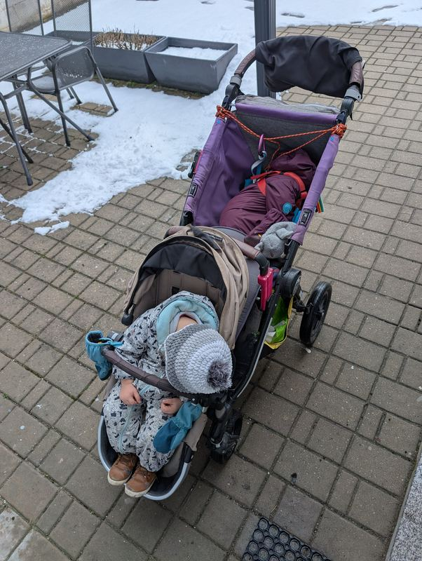
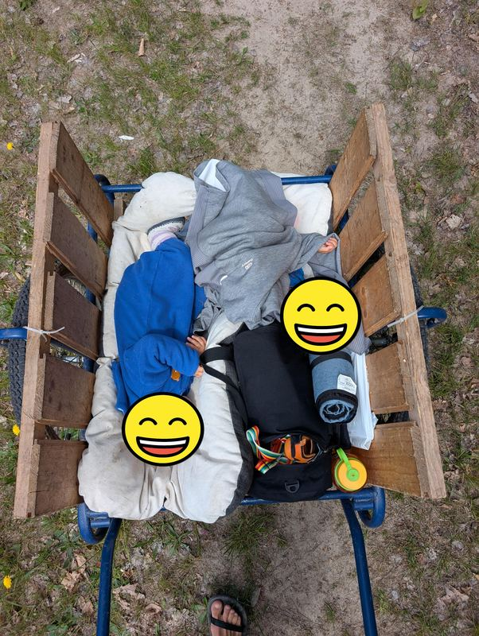
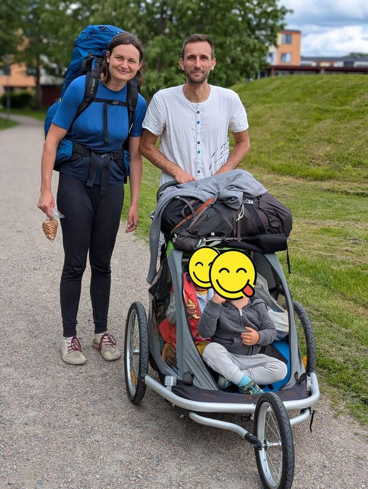
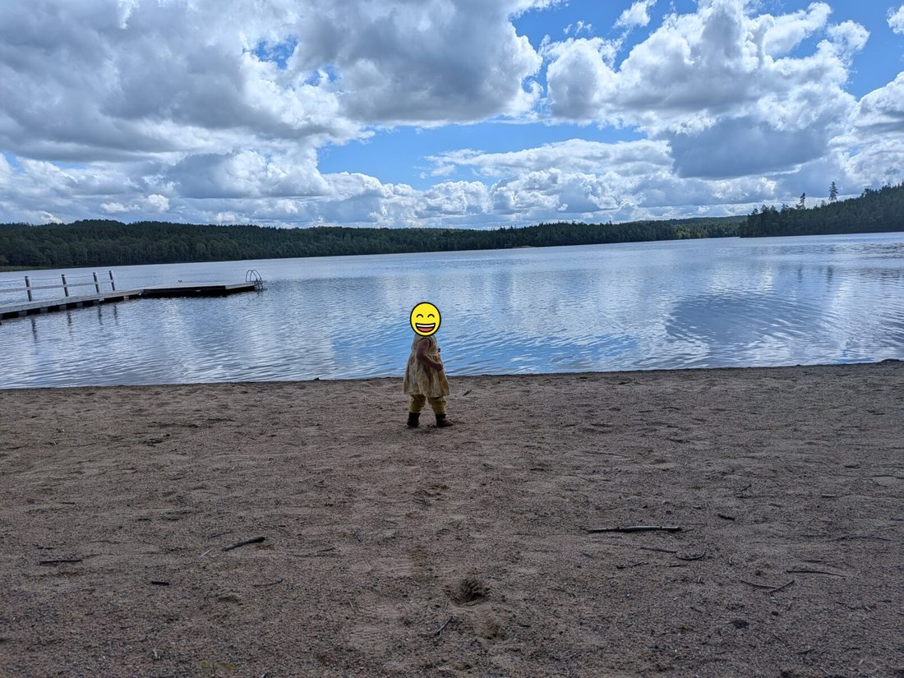
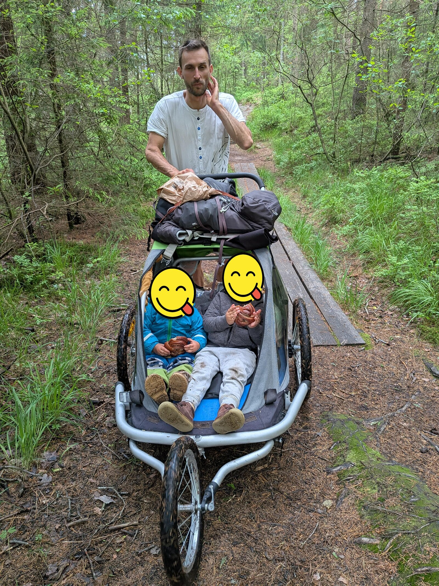

Byli jsme pozváni do Švédska na svatbu. No a říkali jsme si, že když už musíme letět letadlem, zkusíme udělat puťák ve čtyřech. Já, můj muž Eda, náš tehdy dva a půl leťák a naše rokačtvrtťačka.

Přemýšleli jsme a přemýšleli. Jak zabalit stan, spacáky a karimatky plus jídlo pro čtyři lidi do batohů pro dva, aby nám potenciálně zbylo místo pro dvě mrňata, která možná nebudou chtít chodit. Rozhodli jsme se, že budeme puťákovat dva dny před svatbou a dva dny po svatbě: v takovémhle složení by pro naše žrouty a pro nás nebylo možné nést jídlo na týden. Na svatbě snad doplníme kalorie. A tři noci to snad zvládneme.

Samozřejmě jsem dva dny před odletem zjistila, že pro děti nemáme pasy. Takže jsme narychlo posouvali letenky na den před svatbou a doufali, že si zapuťákujeme alespoň potom.

Přemýšleli jsme, jestli vzít kočár (krajně praktický do města a krajně nepraktický do terénu), croozer s rukojetí pro dvě děti, anebo Edovu oblíbenou verzi: dědovu kárku. Ač je dědova kárka objektivně nejlepší na většinu jednodenních horských výletů po Česku, postrádá jednu základní věc nezbytnou pro Švédsko, a to je ochrana před deštěm.

*foto: Dvojkočár*

*foto: Dědova kárka*

*foto: Croozer*

Zvolili jsme tedy dvojmístný croozer. Nejdřív jsme ho naložili do autobusu, který nás dovezl do Prahy na metro. Tam jsme zjistili, že dvojmístný croozer je pro pohyb po Praze krajně nepraktický: nevleze se na pohyblivé schody, v některých případech vůbec na žádné schody, do výtahu ani do průchodu. Takže jsme s ním jeli z Černého Mostu na Zličín a ze Zličína jsme ho nějak narvali do autobusu, kde jsou širší dveře.

Před odbavením jsme ho složili — s takovým monstrem je to na palubu letadla moc. Dál jsme měli jeden veliký batoh, devadesátilitrový, a jeden menší, čtyřicetilitrový. Ten, kdo bude tlačit croozer, bude mít ten čtyřicetilitrový.

Dorazili jsme na letiště a zjistili, že zavolat si Uber, který bude mít dvě sedačky pro děti, je utopie. (To, že bychom ke všemu ostatnímu měli vézt s sebou ještě dvě sedačky, by byla taky blbost.) Takže jsme se co nejvíc přiblížili vlakem a zbytek došli pěšky.

Svatba byla moc krásná: u jezera Uspen.

*foto: Švédsko, Jezero Uspen*

Den po svatbě jsme se vydali na mini puťáček. Náš dvouleťák ťapkal na svůj věk velmi dobře. Přes švédské mokřady často vedou dřevěné lávky a pro dvouleťáka to byly naprosto skvělé překážky, takže když jich bylo dvacet za sebou, dokázal uchodit několik kilometrů. Klasickým terénem se většinou po hodině chození začal trochu nudit.

*foto: dvouleťák na dřevěné lávce přes švédský mokřad*

Eda měl lávky rád podstatně méně. Croozerem na ně vjel předním kolečkem, ale ta zadní byla příliš široká, a tak musel dost velkou část celé váhy nést na rukou.

*foto: svačinka v croozeru po přechodu lávky*

Já nesla devadesátilitrák a sem tam mladší rokačtvrtku, protože ne vždycky se jí v croozeru líbilo tak, jak jsme doufali, že bude. Nejlepší podle ní bylo sedět mámě na krku, nahoře na devadesátilitrovém batohu.

Chvílemi byl terén příliš prudký a museli jsme přenést nejdřív batohy, potom děti, potom obsah croozeru, což bylo většinou snadno dostupné jídlo v taškách, a úplně nakonec vzal Eda croozer nad hlavu a přenesl ho pár desítek výškových metrů.

*foto: Eda nese croozer nad hlavou do prudkého kopce*

Pak jsme našli klasický švédský přístřešek a opekli si párky, co jsme dostali ze svatby.

Naše děti mají tendenci budit se za světla, což je v letním Švédsku docela problém, a tak jsme postavili stan uvnitř přístřešku a nakonec jsme se docela vyspali.

Druhý den jsme kus ušli a děti si trochu spinkly.

*foto: obě děti spí v croozeru*

Pak začalo pršet. A pršelo a pršelo a pršelo. Došli jsme do přístřešku, ale byl to nízký typ přístřešku: nedalo se v něm stát, jenom sedět nebo ležet. Naše děti to nebyly schopné pochopit, a poté, co se po dvacáté bouchly do hlavy a byly ve velmi špatné náladě, zatímco venku lilo jako z konve, jsme to zabalili. Děti jsme nacpali do croozeru, zapláštěnkovali, na sebe hodili pláštěnky a doběhli na autobus a do nejbližšího airbnb. Udělali jsme zajímavý okruh: vrátili jsme se autobusem tam, odkud jsme ráno vyrazili. Airbnb bylo nahoře v kopci, a tak jsme si ten kopec dali ještě jednou.

V airbnb byly děti jako vyměněné a zbaštily zbytek zásob. Ráno jsme se trochu prošli a pak se vydali do Göteborgu na letiště. Že by nás ráno na letiště hodil nějaký uber s dvěma sedačkami a místem pro gigantický croozer, jsme si už naivně nemysleli, takže jsme jeli autobusem večer před odletem (takhle brzy ráno žádné nejely). Od letiště jsme kousek poodešli do místního lesa a přespali tam ve stanu. Ráno se nám dokonce podařilo nacpat spící děti do croozeru; já jsem se vydala na půlhodinovou cestu k letišti a Eda sbalil stan a přidal se k nám později.

Celkově je croozer asi jediný způsob, jak jít na puťák se dvěma extrémně malými dětmi. A ač se mi moc líbil, docela se těším na příští rok, až si náš budoucí tříleťák ponese v batůžku alespoň svačinu a nepovezeme s sebou gigantický croozer.
