In this post I'd like to go back, at least in my head, to a sport that's grown on me more than I ever expected: canyoning. (This is one of the posts from the "before kids" category.)

Canyoning is basically making your way down the bed of a usually fast-flowing stream or river, where every so often you have to jump off a waterfall into the water, slide down the rock like a water slide, or rappel down it. It combines rope and rock work with water work: swimming, orientating underwater, reading the current, and holding your breath longer than usual when you need to swim under a boulder.

## How we got into it

We were introduced to canyoning by our friends from CERN, physics assistant professor [Jason Veatch](https://physics.calpoly.edu/jveatch) and Yuko Maeda. They'd been talking about it for ages, and I couldn't help thinking this was something I'd really, really love. Quietly, I was hoping Eda would love it too. So far I'd been lucky that he was just as much of an outdoor enthusiast as I am, and I didn't want to push my luck.

And then one day the big day came, and we all headed out to the Agnon canyon, not far from Annecy in France.

*photo: the Agnon canyon near Annecy*

## Spring in Ardèche

After that first autumn trip with Jason, Yuko, and other friends, Eda and I — he'd caught the bug too, to my relief — tried some more technical canyons with French guides early the following spring.

In early April we went to Ardèche for a weekend. I was already pregnant by then, so I didn't jump at all (because of the impact) and rappelled everything instead. Wherever there wasn't a rappel already rigged, Eda made himself into a human anchor: he'd sit down behind a rock, tie my rope to his harness, and I'd rappel off him.

Our guide told us we were a bit mad, and that a week earlier he wouldn't have taken us. But it was just the two of us plus two trainee guides, which turned out to be a great opportunity to learn to canyon in a fast, capable group. On the first day we went straight for two canyons: La Fustugère and Chassezac. The guide also tipped us off about a canyon for the following days that combines zip lines with canyoning: Aéro Besorgues.

Some groups drive up to a canyon in two cars: one left at the top by the entry point, the other at the bottom by the exit. I'm not really a fan — I feel like I have to earn the canyon at least a little, and hike up to the entry on my own two feet, gear and all.

*photo: the approach to La Fustugère canyon*
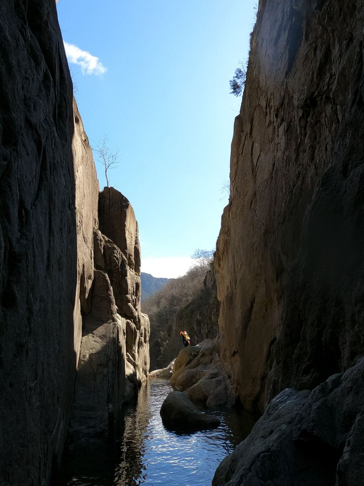
*photo: inside La Fustugère canyon*

<iframe src="https://www.youtube-nocookie.com/embed/8C9AnId-pzk" title="A jump caught on GoPro" loading="lazy" allowfullscreen style="width:100%;aspect-ratio:16/9;border:0;"></iframe>

*A jump caught on GoPro.*

On the second day, Eda and I dared to go out on our own for the first time and did the Borne canyon. The phrase of the day became: "This canyon would be amazing in summer." Despite all our wetsuits we were freezing. Except for our son — tucked inside my womb, he definitely had the best wetsuit of all of us. Normally I love moving through the water on a canyoning trip and try to maximise it, but here we stuck to the edges and only got into the water when there was no other way. We tried to keep our hands above the surface, just to hold onto a bit of feeling in them.

*photo: the Borne canyon*
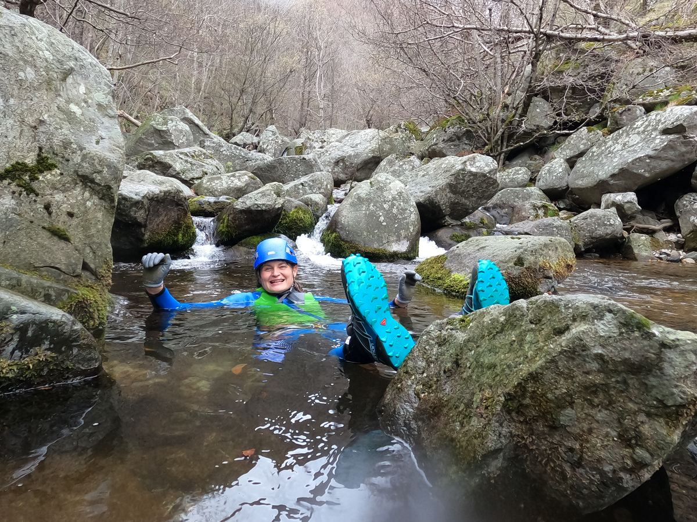
*photo: one last shot from Borne*

On the last day, on our guide's recommendation, we headed to the warmer Aéro Besorgues canyon, which combines classic canyoning with a zip line and a slow descent into the water.

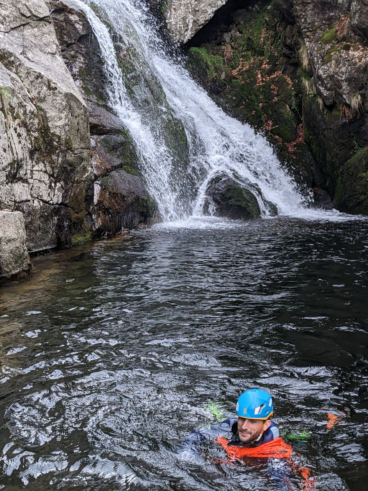
*Aéro Besorgues*

<iframe src="https://www.youtube-nocookie.com/embed/dj2ratKdhwo" title="The zip line at Aéro Besorgues" loading="lazy" allowfullscreen style="width:100%;aspect-ratio:16/9;border:0;"></iframe>

*The zip line at Aéro Besorgues.*

## We fell for canyons completely

We spent the rest of the summer completely hooked on canyons. We went to the cave canyon Grotte de Gournier, where we worked our way up part of the canyon from the bottom, and caving gear got added to our canyoning kit. Crystal-clear water inside a cave is already a rarity on its own, but this one had another layer to it: a super-cold pool in the middle of a scorching summer, plus a short stretch that was basically a mini via ferrata through the cave.

*photo: arriving at the Gournier cave by boat*
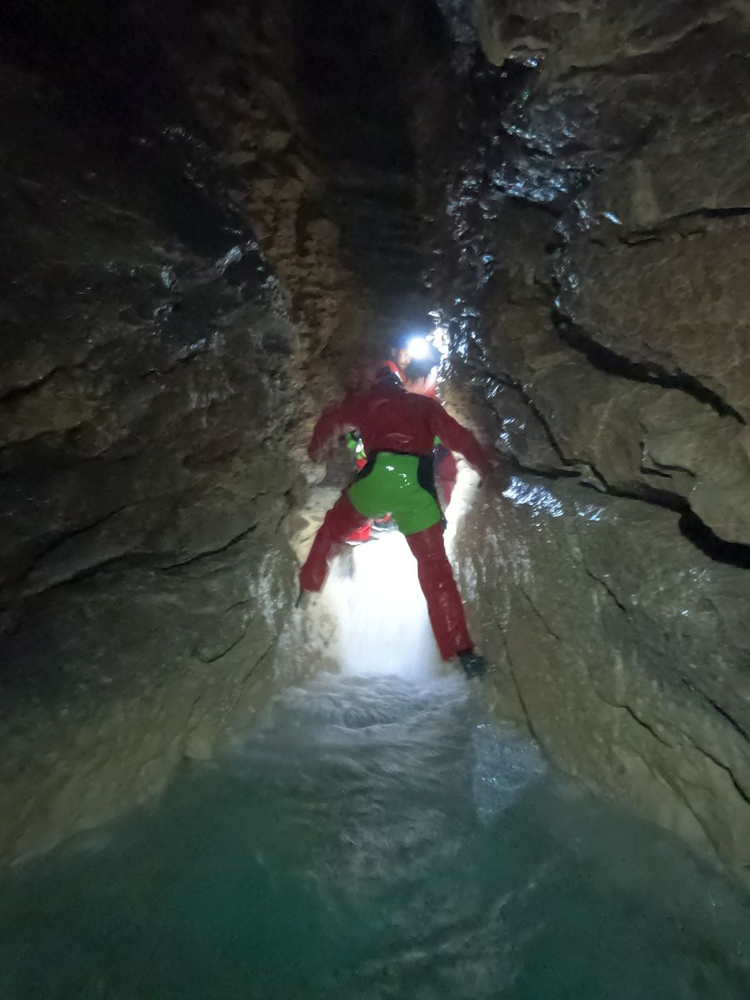
*photo: crystal-clear water in Grotte de Gournier*

The majestic Furon, right behind Grenoble, would probably be enough on its own to convince me to move to Grenoble for good.

*photo: me in the Furon*

<iframe src="https://www.youtube-nocookie.com/embed/rXOV9bqHd_c" title="Rappelling the Furon" loading="lazy" allowfullscreen style="width:100%;aspect-ratio:16/9;border:0;"></iframe>

*Rappelling the Furon.*

At the l'Alloix waterfall, a professional photographer caught us on camera. He asked for our emails at the bottom of the falls and later sent us the professional shots.

*photo: rappelling l'Alloix (me)*

*photo: at the foot of one of the l'Alloix waterfalls*

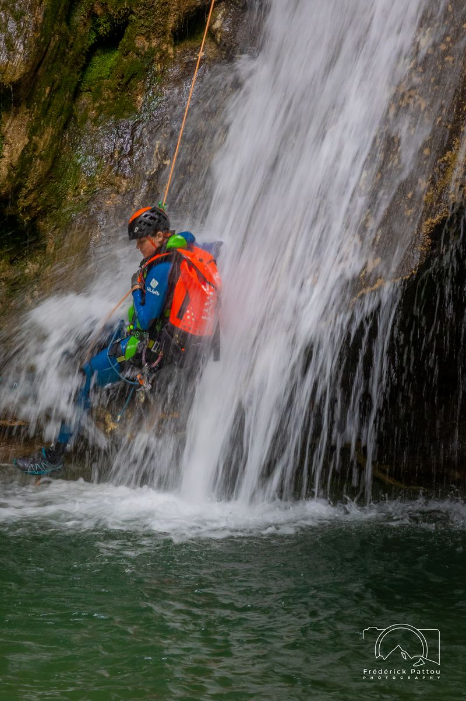
*photo: rappelling l'Alloix (me)*

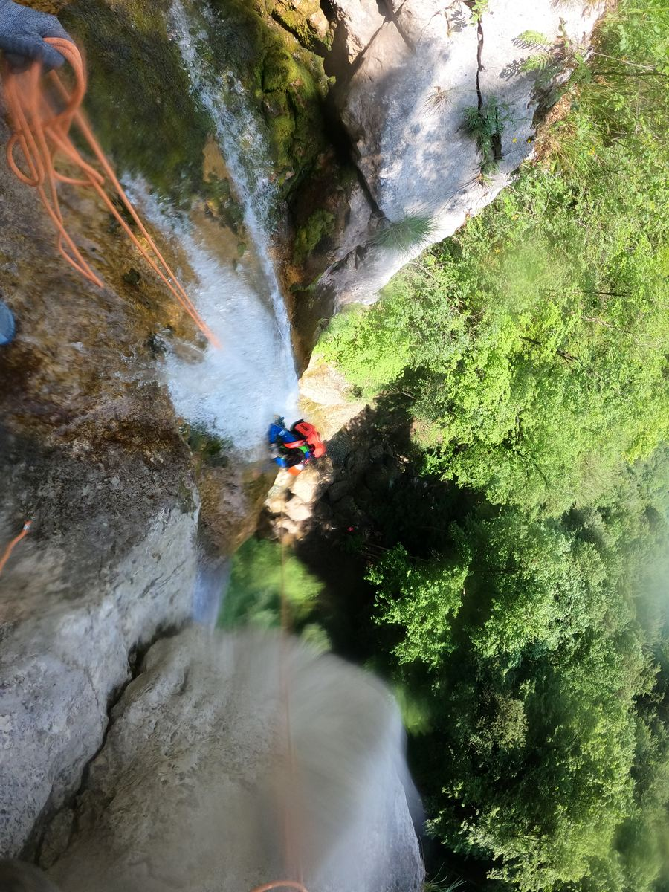
*photo: the forty-metre l'Alloix waterfall from above*

<iframe src="https://www.youtube-nocookie.com/embed/EUJRPyEqV8s" title="Rappelling l'Alloix, view from above" loading="lazy" allowfullscreen style="width:100%;aspect-ratio:16/9;border:0;"></iframe>

*Rappelling l'Alloix, view from above.*

<iframe src="https://www.youtube-nocookie.com/embed/9pIMIqbC2w4" title="Rappelling l'Alloix, view from below" loading="lazy" allowfullscreen style="display:block;width:100%;max-width:360px;aspect-ratio:9/16;border:0;margin:0 auto;"></iframe>

*Rappelling l'Alloix, view from below.*

My personal favourite, though, is Pont du Diable: a beautiful, fairly deep and narrow canyon. It was short, so we did it twice.

*photo: Pont du Diable*

*photo: Pont du Diable, round two*

The total opposite was the Swiss canyon near Château-d'Œx — very open.

*photo: the canyon near Château-d'Œx*

Ruisseau des Gorges was basically the only mud-fest of a canyon we've ever done.

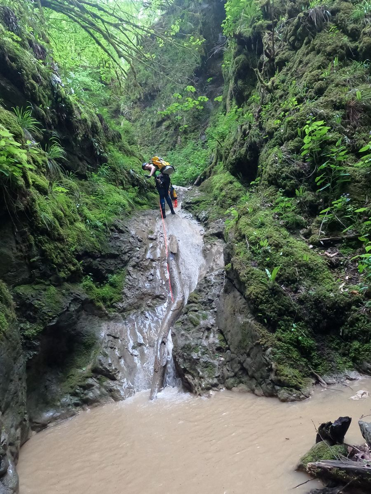
*photo: Ruisseau des Gorges*

And we even brought my little brother along to the beautiful, tiny, easy Frontenex canyon (though that's Eda in the photo).

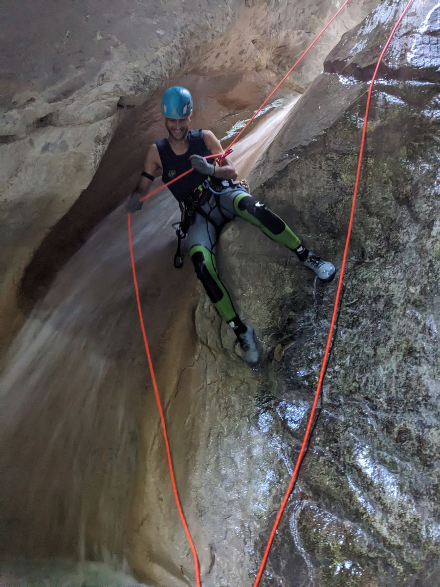
*photo: Frontenex*

## Good to know before you get into a canyon

### The canyon map

A canyon map usually shows a profile of the canyon descending from top to bottom, with notes along it. The exact notation can vary, but generally it tells you how long the next drop is and whether you need to rappel, jump, or slide down it. For example, T3 means a three-metre toboggan slide, S5 a five-metre jump, and C10 a ten-metre waterfall you rappel down.

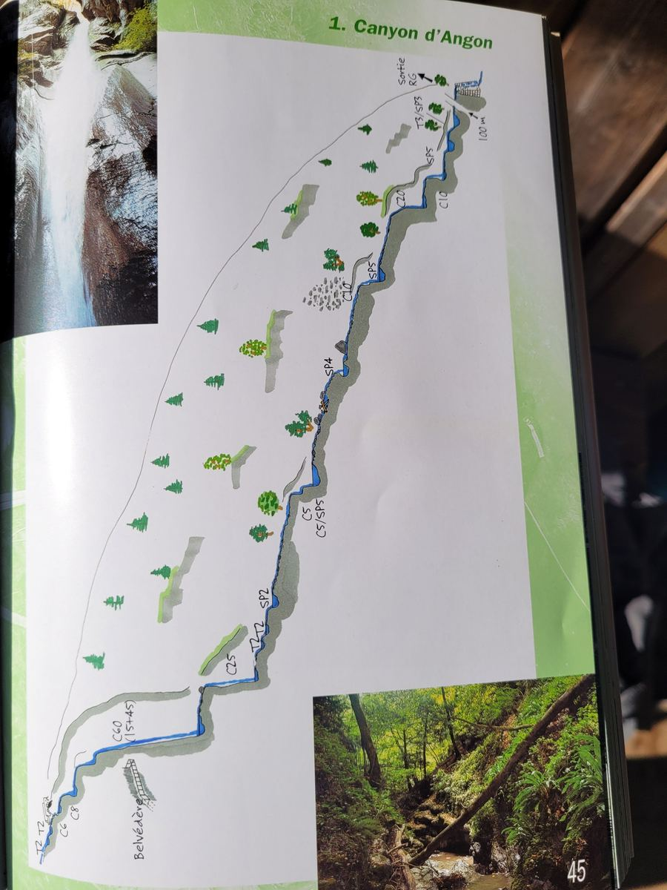
*photo: the canyon map*

On later trips I tried to memorise the route's profile: in moving water, digging the map out of a waterproof barrel in your backpack can be a real pain. Video maps are also very useful — GoPro footage from groups who've already done that particular canyon. It made it much easier for me to picture the canyon ahead of time. A map tells me roughly how tall it'll be, but not how wide, or exactly where the bolted anchors are that we can clip our rope into.

### Gear

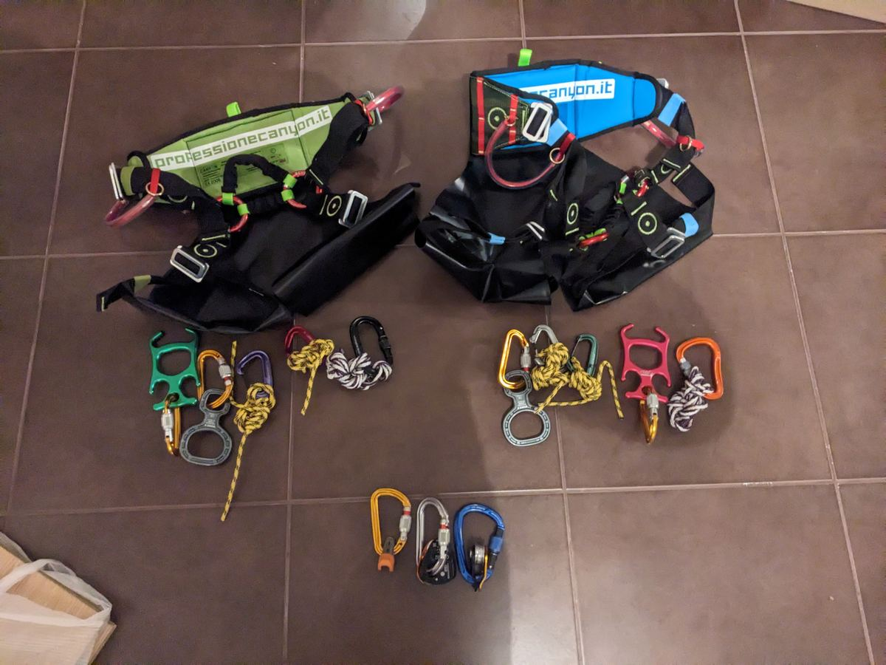
*photo: canyoning gear (minus the wetsuit)*

**Wetsuit.** Canyoning needs a thick wetsuit, usually in two pieces: dungaree-style trousers and a jacket. Around 4 mm on the legs, 5 mm on the arms, and since both layers overlap on the chest, that's often nearly 9 mm there. Very early in spring you can still be cold even in it; in summer, in warmer, sun-soaked canyons, we sometimes went without the top layer.

**Shoes and socks.** Neoprene socks and sturdy shoes with a sole that grips wet rock. (There are canyoning-specific ones, but I've had better luck with ordinary hiking boots, which grip wet rocks well.)

**Helmet.** Just like in climbing, a bit of rock can fall on your head, or you can knock your head against the rock.

**Harness with a seat protector.** Canyoning harnesses have reinforced padding at the back, because you end up sliding down rock on your backside a lot.

**Rappel device, cow's tails, and carabiners.** You clip your cow's tails into the anchor point before you start handling the rope at all.

**Rope.** Static, and you need to find a balance between thickness and weight. One of a canyoner's worst enemies is a rope that gets tangled in the water. Length is usually about twice the longest waterfall you'll face (you rappel off one end and pull the other to drop the rope down after you). For very long waterfalls, people sometimes take only a half-length rope and tie it to a thin cord, which is then used to pull the thick rope down afterwards. That setup has its downsides: pulling it down is far from trivial, and the thin cord mustn't tangle while you're rappelling.

**Backpack and dry barrel.** A backpack with holes that let the water drain out, and inside it a waterproof barrel for food, your phone, and the car keys.

**Knife and whistle.** A knife to cut the rope if it gets tangled in the water, and a whistle, because you won't hear each other over the roar of a waterfall.

**Diving goggles.** For checking the bottom before a jump.

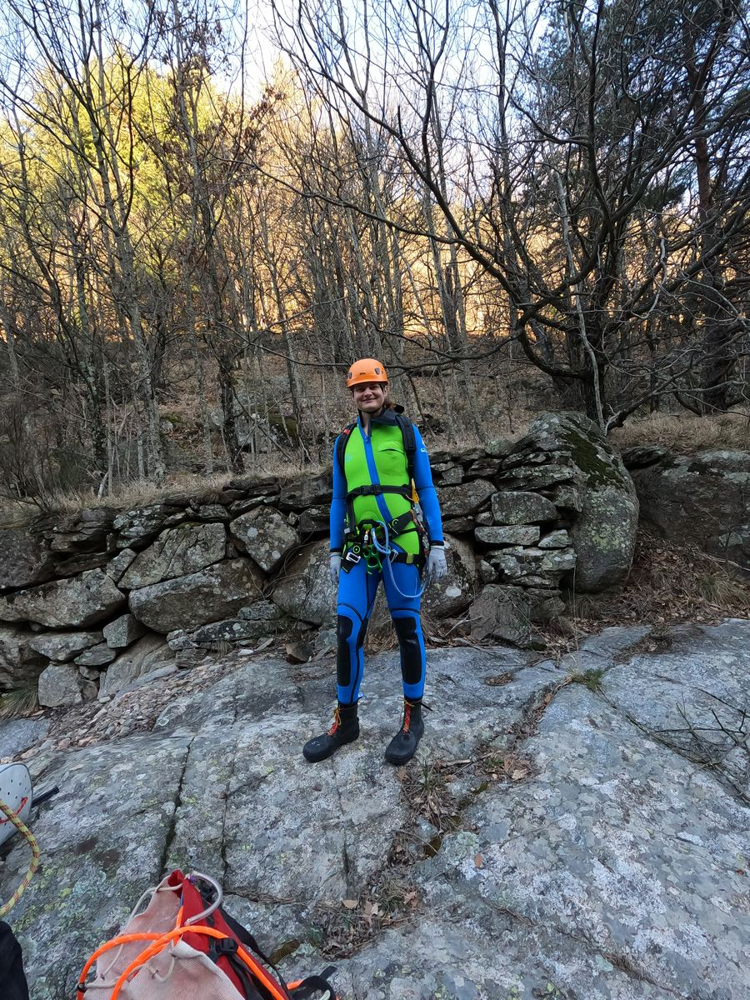
*photo: wetsuits, shoes, and helmets*

### Jump, or rappel?

For any jump higher than two metres, there's always the option to rappel instead. Jumping is generally the most dangerous part of canyoning, and when a canyon is running too low, it's not wise to jump. It's equally unwise to jump without checking even a spot you already know well: after a storm there could be logs or rocks down there. Ideally, someone should always rappel down first and check the bottom with diving goggles to make sure it's safe.

### Rope and anchors

When rappelling, it's important to judge the rope length correctly. Too short, and you can run out of rope before you can land safely in the water. Too long, and you risk getting tangled in it once you're in the water. Especially in faster, swirlier water, it's really important to swim as far away from the waterfall as you can.

I had my rope marked with black tape so I'd know how much I was feeding out as I tied in. Sometimes you could see the end of the rope touching the water, but from around ten metres up I often couldn't tell any more, and in practice three metres either way made a big difference.

In the maintained French canyons, there are steel anchor rings above each waterfall. When a waterfall is, say, forty metres and running hard, and rigging the rope right at the edge would risk a fall, there's often an anchor further back, before the last pool. So you tie in there first, then re-rig the rope at the actual edge of the falls.

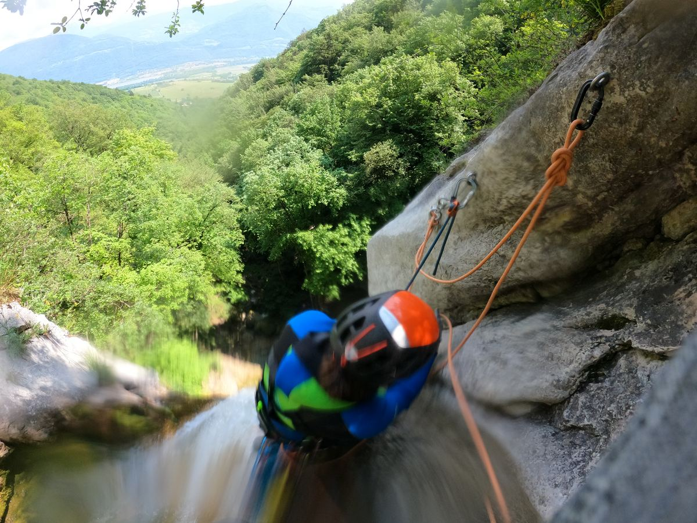
*photo: rigging the rappel on the forty-metre l'Alloix waterfall takes care*

### What's actually dangerous about it

Paradoxically, the biggest danger in canyoning isn't falling off a waterfall, but bad jumps and unpredictable rain. It depends on the type of canyon: rain is the biggest threat in deep, narrow canyons, which flood very quickly.

## And why I don't feel like swimming in the Berounka anymore

In one way, canyoning ruined my life: once you know what kind of gorgeous, crystal-clear pools you can rappel into, and what it's like to swim alone in the middle of a majestic pool ringed by rock, you stop feeling like swimming in just any old puddle.

## Resources

The best resource for European canyons is hands-down the French site [descente-canyon.com](https://www.descente-canyon.com/): a huge database of canyons with descriptions and photos. We usually didn't dare go into a canyon without a guide as the very first people of the season, so I'd always check there first to see if anyone had already been, and whether the water was running at a sensible level after winter.

Various videos on YouTube helped a lot too. For the more technical canyons, I'd try to watch ahead of time what was waiting for us and memorise the map.

## Canyons we've done

- Agnon and Montmin (near Annecy)
- La Fustugère, Chassezac, Borne, Aéro Besorgues (Ardèche, around Aubenas)
- Grotte de Gournier, l'Alloix, Grotte de l'Olette, Furon (lower) (around Grenoble)
- Pont du Diable (near Annecy) — my personal favourite
- Château-d'Œx (Switzerland)
- Ruisseau des Gorges, French Jura — basically the only mud-fest of a canyon we've ever done
- Frontenex (near Annecy)
