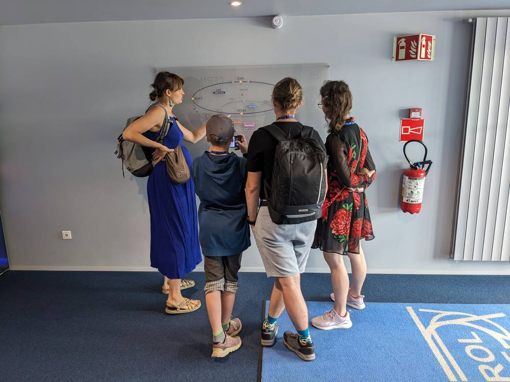

For ten years I studied how radiation damages silicon detectors — first in Lund, Sweden and at the European Spallation Source, then at CERN. Along the way I became a mother of two, learned to canyoneer, and climbed a few alpine peaks. And these days I write: a comic novel, and short humorous columns about everything that's funny about science — and about life.

## The physics I loved

At CERN I worked on how radiation damages the silicon detectors used in high-energy physics — specifically non-ionizing energy loss (NIEL), and why the simplifying assumptions the field usually relies on don't always hold. I combined Geant4 and TRIM/SRIM simulations with experimental validation (CV-IV, TCT, DLTS, TSC) — measurements that show what's actually happening inside damaged silicon.

Before that, at the European Spallation Source in Sweden, I took a neutron detector concept from scratch through design, calibration, testing, and publication. I liked it for its own sake: building something that didn't exist yet, then measuring it honestly.

## Explain, don't intimidate

At CERN I also volunteered as a guide, leading members of the public through the accelerator — and found that explaining high-energy physics to a curious visitor is harder, and more interesting, than writing a paper about it. That experience convinced me that complicated things can be explained clearly without frightening the reader, or the listener. It's a skill I now use in writing as much as in science.

## Piano and other detours

Before physics, I spent four years studying piano at the Janáček Conservatory in Ostrava. I didn't stay with music, but what it taught me — patience, a feel for rhythm and sentence structure, the ability to practise the same passage twenty-five times without losing my mind — still serves me now that I'm assembling sentences instead of notes.

## Experience

**CERN** — Researcher, Nov 2020 – Apr 2024, Geneva, Switzerland
Radiation damage in silicon detectors; non-ionizing energy loss (NIEL) beyond standard assumptions. Geant4 and TRIM/SRIM simulation pipelines combined with experimental validation (CV-IV, TCT, DLTS, TSC). Volunteered as a CERN guide, leading public tours.

**European Spallation Source ERIC** — Junior Research Scientist, May 2017 – Oct 2020, Sweden
Neutron detector systems and beam monitors. Took a detector concept from design through calibration, testing, and publication. Geant4, Python, C++.

## Education

**PhD, Engineering / Applied Physics** — University of Hamburg, 2020–2024
**MSc, Physics** — Lund University, 2017–2019
**BSc, Physics** — Lund University, 2014–2017
**Piano** — Janáček Conservatory, Ostrava, 2008–2011

## Skills & languages

Geant4, TRIM/SRIM, Python, C++, Linux, detector instrumentation, science communication.

Languages: Czech (native), Slovak (fluent), English (fluent), German (working), Polish (working), Swedish (basic), Persian (basic).

Certification: Frontier AI Governance.

## Contact

- Email: [maulerova@gmail.com](mailto:maulerova@gmail.com)
- GitHub: [github.com/Vendusha](https://github.com/Vendusha)
- LinkedIn: [linkedin.com/in/vendulasubert-425a9184](https://www.linkedin.com/in/vendulasubert-425a9184)
- ORCID: [0000-0002-2791-0659](https://orcid.org/0000-0002-2791-0659)
