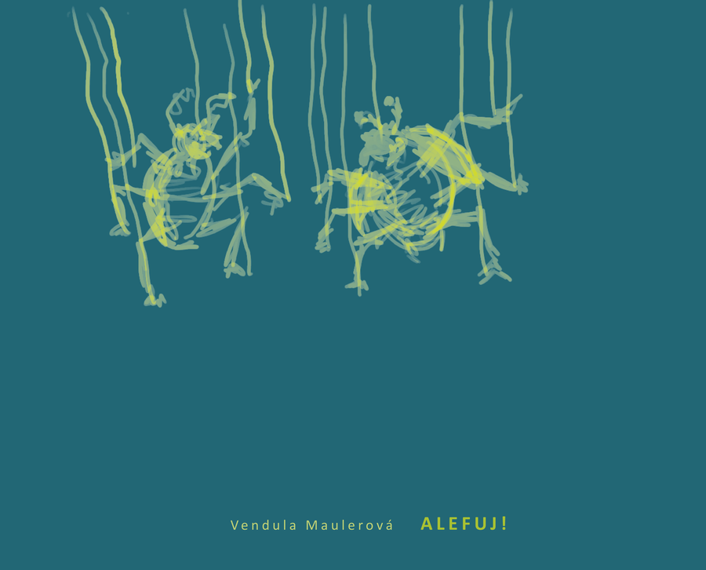
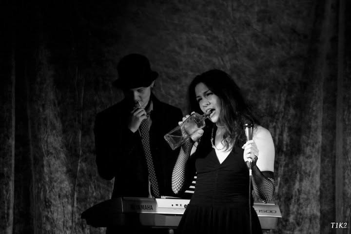

Jsem fyzička, která jednou na pohovoru řekla, že umí sešroubovat nábytek z IKEA, a přesunula se ze škatulky "teoretik" do škatulky "kutil". Výsledkem je, že po pár letech v této práci umím pájet, svařovat, nastavovat dozimetry, měřit, udržovat v chodu laboratoř, psát vědecké články, programovat a lámat si hlavu nad tím, jak záření mění materiály na úrovni jednotlivých atomů. Tři a půl roku jsem strávila v CERNu, předtím tři roky ve švédském ESS (European Spallation Source). V CERNu jsem kromě výzkumu taky dobrovolně prováděla veřejnost po urychlovači. Dnes jsem na mateřské se dvěma dětmi, ale fyzika mě pořád nepustila – naposledy jsem se snažila dvouletému dítěti vysvětlovat, jak funguje kvantování u elektronů. Rubrikou [Fyzika a jiné zvědavosti](/cs/zvedavost/) se teď snažím lidem místa jako CERN přibližovat.

## Na čem teď pracuju

*foto: ilustrační foto knihy ALEFUJ!*

Jeden z největších projektů, na kterých teď dělám, je knížka [ALEFUJ!](https://alefuj.cz/cs/). Je to humoristická kniha, ve které se Kosťa snaží najít práci, která by měla smysl. Ale protože smysl většinou vidí jinde než jeho šéf, v každé kapitole si Kosťa hledá práci novou. Naproti tomu Báře dává smysl studovat chemii, ale místo toho většinu času tráví hlídáním dvou malých příšer, hraním v amatérském orchestru a pátráním po záhadném muži, který desítky let anonymně radil Nobelovu výboru pro fyziku.

## Moje odbornost ve zkratce

*foto: testování detektoru v Berlíně*

Umím navrhnout detektor, oživit ho, změřit, nasimulovat a popsat v článku. Moje specializace je neutronika a fyzika křemíkových detektorů – konkrétně radiační poškození a defektní struktury. Můj detailně vysvětlený životopis, najdete v sekci [Publikace](/cs/publikace/).

## Co mě živí (živilo) mimo fyziku

*foto: chansonový koncert, Ostrava*

Vystudovala jsem klavír na Janáčkově konzervatoři v Ostravě, hrála jsem na koncertech (doprovázela jsem umělkyni Vilemínu Hanu Ondrušovou na chansonových večerech), měla jsem i vlastní program "Muzikálové melodie". Hrávala jsem na varhany a na klavír na svatbách i pohřbech v Česku a ve Švédsku. Zpívala jsem jako účinkující ve sboru na koncertě v Kodani při turné hudby z Hry o trůny – a dirigoval nás sám Ramin Djawadi.

## Kdo jsem taky

*foto: canyoning l'Alloix, Francie*

Jsem máma dvou malých dětí. Spolu s mužem se snažíme dětem předat lásku k přírodě – lezeme, jezdíme na kolech (i v kraji, kde je auto král), objevujeme rokle a strmé cesty. Outdoor pro nás není jen koníček, je to způsob života. Velkou hodnotou pro nás je, aby se naše děti hýbaly a aby si k outdooru vytvořily vztah. Rubrika [Outdoor s dětmi i před dětmi](/cs/outdoor/) jsou tedy naše tipy, jak se dá dělat outdoor, když máte dvě malé děti blízko po sobě.

