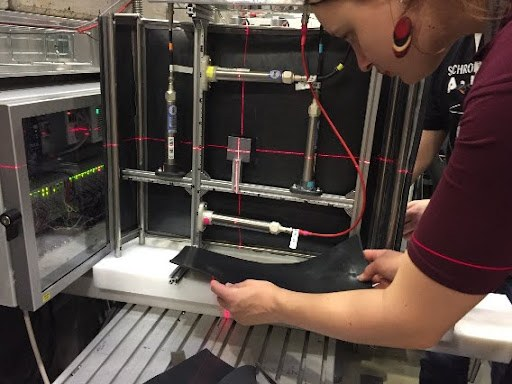
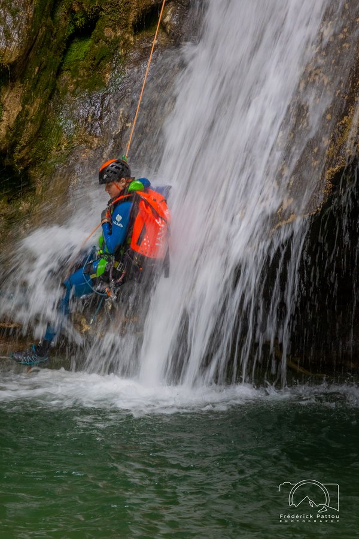

I'm a physicist who once mentioned in a job interview that she can assemble IKEA furniture, and that alone was enough to get me moved from the "theorist" box into the "can actually build things" box. The result is that after a few years in this job I can solder, weld, calibrate dosimeters, take measurements, keep a lab running, write scientific papers, code, and rack my brain over how radiation changes materials at the level of individual atoms. I spent three and a half years at CERN, and three years before that at the European Spallation Source (ESS) in Sweden. At CERN, alongside the research, I also volunteered as a guide, taking visitors through the accelerator. These days I'm on maternity leave with two kids, but physics still hasn't let go of me — most recently I found myself trying to explain electron quantization to a two-year-old. These days I try to bring places like CERN a little closer to people through the [Physics and other curiosities](/en/zvedavost/) column.

### What I'm working on now

*photo: cover art for ALEFUJ!*

One of the biggest projects I'm working on right now is the book [ALEFUJ!](https://alefuj.cz/cs/). It's a comic novel in which Kosťa keeps trying to find work that actually means something — but since he usually finds the meaning somewhere his boss doesn't, he ends up looking for a new job in pretty much every chapter. Bára, meanwhile, finds meaning in studying chemistry, except she spends most of her time babysitting two small monsters, playing in an amateur orchestra, and chasing down a mysterious man who spent decades anonymously advising the Nobel Committee for Physics.

### My expertise in brief

*photo: testing the detector in Berlin*

I can design a detector, bring it to life, take measurements, run simulations, and write it up in a paper. My specialty is neutronics and silicon detector physics — specifically radiation damage and defect structures. My full professional background is on the [My CV](/en/publikace/) page.

### What kept me going outside physics

*photo: a chanson concert, Ostrava*

I studied piano at the Janáček Conservatory in Ostrava, performed at concerts (accompanying the artist Vilemína Hana Ondrušová at chanson evenings), and even had my own programme, "Musical Melodies." I played organ and piano at weddings and funerals in both the Czech Republic and Sweden. I sang in a choir at a concert in Copenhagen on a Game of Thrones music tour — conducted by Ramin Djawadi himself.

### Who else I am

*photo: canyoning at l'Alloix, France*

I'm a mother of two young children. Together with my husband, we're trying to pass on a love of the outdoors to them — we climb, we cycle (even in a region where the car is king), we go exploring gorges and steep trails. For us, the outdoors isn't just a hobby, it's a way of life. It matters a lot to us that our kids move, and that they grow up with a real relationship to the outdoors. So the [Outdoors, with kids and before them](/en/outdoor/) column is our running collection of tips for doing the outdoors when you have two small kids close in age.
