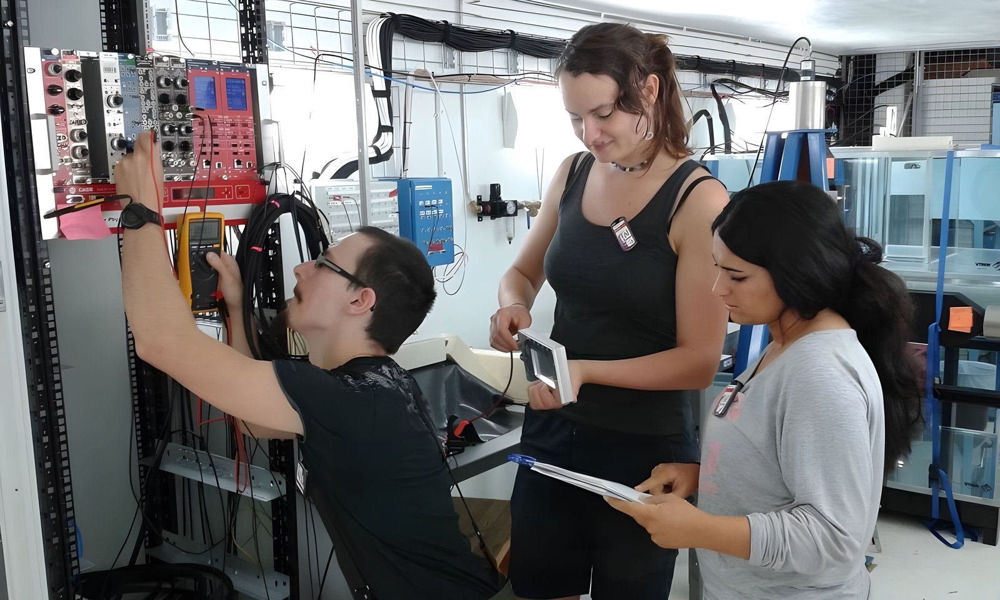

Moje specializace je neutronika a fyzika křemíkových detektorů. Ve zkratce: pracuju s přístroji, které zachytávají částice, a zkoumám, co se s nimi děje, když je ozařujeme.

V posledních letech jsem se věnovala tomu, jak záření poškozuje křemíkové detektory. Když do materiálu vletí vysokoenergetická částice – třeba proton – napáchá si v křemíku svou daň v podobě složitých defektů, které se chovají jinak, než bychom čekali podle všech modelů, které máme k dispozici. Během doktorátu na Univerzitě v Hamburku jsem hledala způsoby, jak tyhle jevy lépe popsat. Testovala jsem především křemíkové detektory – technologii, která není důležitá jen v CERNu, ale třeba i ve vesmírném výzkumu, a jsou na ní založené i fotografické snímače.

Při výzkumu jsem kombinovala počítačové simulace s experimenty v laboratoři. Simuluju v programech Geant4 a TRIM/SRIM, píšu si vlastní kódy v Pythonu a C++ a pak si všechno ověřuju měřením – metodami s názvy jako CV-IV, TCT, DLTS a TSC (což jsou v podstatě různé způsoby, jak "proklepnout" detektor a zjistit, co se v něm děje). Baví mě právě ten přesah: od teorie přes kód až k přístroji, na kterém si ušpiním ruce.

Před CERNem jsem ve švédském ESS (European Spallation Source) pracovala na vývoji monitoru neutronových svazků – od první myšlenky přes návrh, kalibraci a testování až po publikaci funkčního prototypu. Monitor byl v podstatě kus vanadového kovu obklopený čtyřmi heliovými detektory po stranách. Princip byl jednoduchý: vanadium reaguje jen s velmi malou částí neutronů, takže neutronový svazek zůstával téměř nerušený, a ty neutrony, které se od vanadia odrazily, zachytily heliové detektory. Navrhovala jsem design, řešila elektroniku, měřila detektor na skutečných svazcích a v publikaci jsem ho předložila ESS jako jednu z možných technologií.

V ESS a na Lundské univerzitě jsem se naučila nejen fyziku, ale i to, jak nainstalovat a udržovat Linuxové systémy se speciálními ovladači pro detektorovou elektroniku, jak nastavit monitorování radiace a jak jezdit po evropských laboratořích a ladit hardware pod časovým tlakem. Zkrátka: umím si poradit, i když to v manuálu není.

## Technické dovednosti

**Simulace a výpočty:** Geant4, TRIM/SRIM, Python, C++

**Experimentální techniky:** CV-IV, TCT, DLTS, TSC, měření s radioaktivními zdroji a na neutronových svazcích

**Hardware:** vývoj a stavba detektorů, monitory neutronových svazků, pájení, svařování, drobné manuální práce a laboratorní práce

**Systémy:** Linux (CentOS, Ubuntu), správa testovací infrastruktury, Windows, Mac

**Komunikace vědy:** průvodce v CERNu (veřejné prohlídky), popularizační přednášky

## Jeden konkrétní výsledek

V European Spallation Source jsem navrhla vanadiový monitor neutronového svazku a dovedla ho od konceptu přes kalibraci a testování až k publikaci jako první autorka v [Physical Review Accelerators and Beams](https://doi.org/10.1103/PhysRevAccelBeams.23.072901).

## Publikace

Publikovala jsem pod původně pod jménem — V. Maulerova. Poté jsem se vdala, takže mám rovněž publikace se jmény V. Maulerova-Subert a Vendula Šubert.

Test detektoru s kolegy na Source Testing Facility (Lund, Švédsko).
